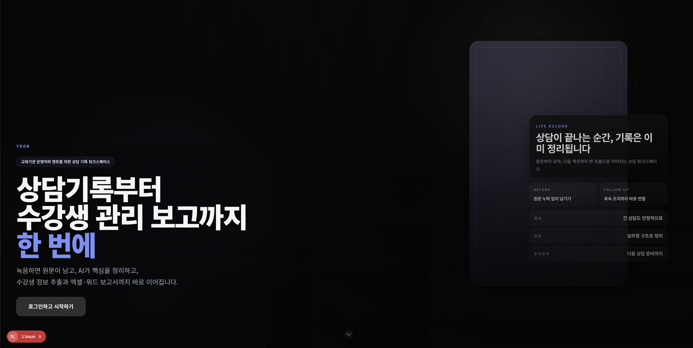
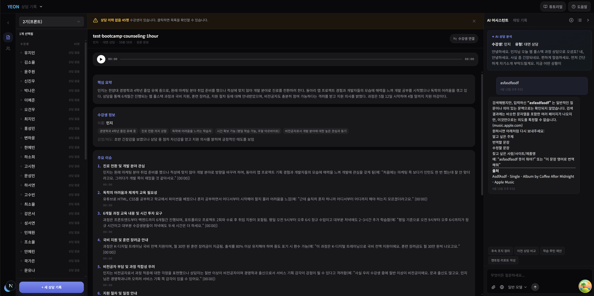
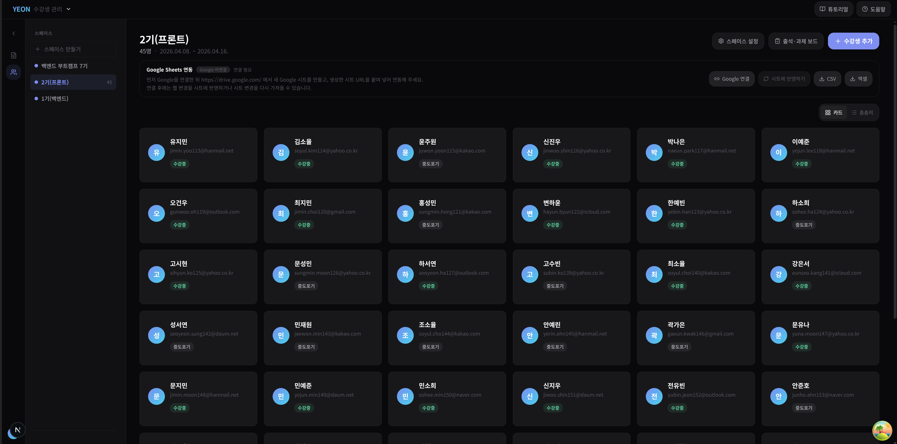
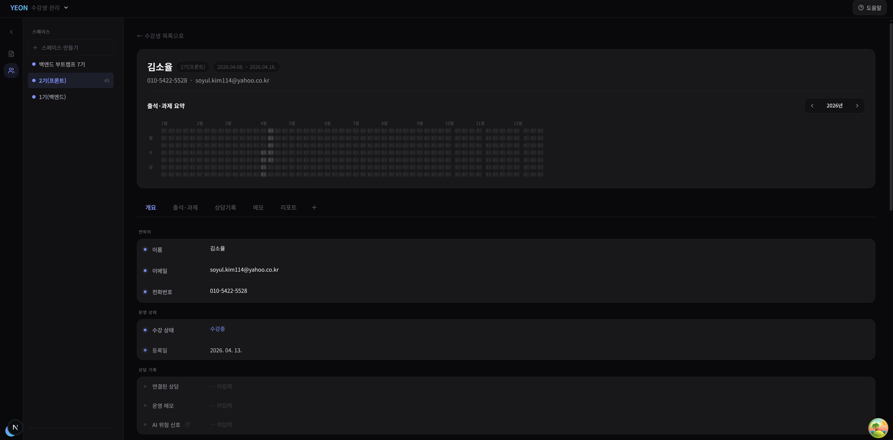
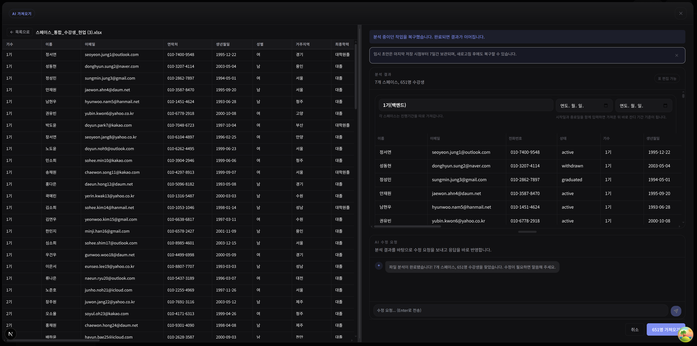

# YEON

> 상담이 끝난 뒤에 기록을 정리하는 것이 아니라, 상담이 끝나는 순간 다음 운영 업무까지 이어지게 만드는 워크스페이스

YEON은 부트캠프와 교육 프로그램 운영자, 멘토를 위한 상담 기록 워크스페이스입니다.
녹음으로 남긴 상담을 원문, 구조화 요약, AI 보조, 수강생 관리, 운영 보고 흐름으로 연결합니다.

## 첫 인상

| 랜딩                                        | WebGL 로봇 랜딩                                         |
| ------------------------------------------- | ------------------------------------------------------- |
|  |  |

YEON의 도입부는 범위를 넓게 약속하지 않습니다.
`상담기록부터 수강생 관리 보고까지 한 번에`라는 문장처럼, 한 번의 상담이 이후 운영 작업으로 흩어지지 않게 만드는 제품이라는 점을 먼저 보여줍니다.

## 1. 원문이 없으면 상담 기록을 믿을 수 없습니다



상담 기록 화면은 한 건의 상담을 끝까지 책임지는 중심 화면입니다.

- 왼쪽에서 수강생별 상담 기록을 빠르게 고를 수 있습니다.
- 가운데에서 원문, 핵심 요약, 주요 이슈를 한 화면에서 함께 봅니다.
- 오른쪽 AI 패널은 현재 선택한 상담을 근거로 후속 질문과 정리를 돕습니다.

YEON이 먼저 지키는 원칙은 `원문 -> 구조화 요약 -> 다음 액션`의 순서입니다.
요약만 남는 제품이 아니라, 운영자가 다시 근거를 확인할 수 있는 기록 시스템을 목표로 합니다.

## 2. 상담 한 건은 수강생 맥락으로 이어져야 합니다

| 수강생 목록                                        | 수강생 상세                                   |
| -------------------------------------------------- | --------------------------------------------- |
|  |  |

상담 기록이 쌓이면 결국 개별 수강생의 맥락으로 다시 모여야 합니다.

- 스페이스 단위로 수강생을 관리하고 현재 상태를 빠르게 파악합니다.
- 한 명의 수강생 안에서 출석, 과제, 상담 기록, 메모, 리포트를 연결해서 봅니다.
- 운영자는 상담 한 건이 아니라 수강생 변화의 흐름을 기준으로 후속 조치를 정리할 수 있습니다.

## 3. 반복적인 운영 정리는 AI가 먼저 초안을 만들어야 합니다



운영 업무는 상담 기록만으로 끝나지 않습니다.
YEON은 대량의 명단과 운영 데이터를 읽고, 스페이스와 수강생 정보를 정리하는 초안을 AI가 먼저 만들게 설계하고 있습니다.

- 업로드된 명단을 분석해 스페이스와 수강생 구조를 복구합니다.
- 운영자는 AI가 만든 초안을 검토하고 수정 요청을 보낸 뒤 바로 반영할 수 있습니다.
- 결과적으로 기록 업무와 운영 데이터 정리가 한 제품 안에서 이어집니다.

## YEON이 닫으려는 흐름

1. 상담을 녹음하거나 업로드합니다.
2. 원문 전체 텍스트와 구조화 요약을 확인합니다.
3. AI와 함께 후속 질문, 액션, 운영 포인트를 정리합니다.
4. 상담 내용을 수강생 단위 맥락으로 누적합니다.
5. 명단 정리와 운영 보고까지 같은 워크스페이스에서 이어갑니다.

## Repository

- `apps/web`: Next.js App Router 기반 웹 앱
- `apps/mobile`: 향후 Expo 모바일 앱 자리
- `packages/api-contract`: 공용 API 계약의 source of truth
- `packages/api-client`: typed HTTP client
- `packages/domain`: 런타임 독립 비즈니스 로직
- `packages/design-tokens`: 공용 디자인 토큰
- `packages/utils`: 공용 순수 유틸리티

## Run Locally

1. `apps/web/.env.example` 값을 기준으로 로컬 환경 변수를 준비합니다.
2. PostgreSQL을 실행하고 `DATABASE_URL`을 연결합니다.
3. 필요한 OAuth/인증 값을 채웁니다.
4. 아래 명령으로 웹 앱을 실행합니다.

```bash
pnpm dev:web
```

자주 쓰는 검증 명령:

```bash
pnpm lint
pnpm prettier:fix
pnpm typecheck
pnpm build:web
```

## Related Docs

- [Raspberry Pi Docker Compose Guide](./docs/deployment/raspberry-pi-docker-compose.md)
- [GitHub Actions + GHCR Guide](./docs/deployment/github-actions-ghcr.md)
- [Google Search Console 운영 가이드](./docs/seo/google-search-console.md)
