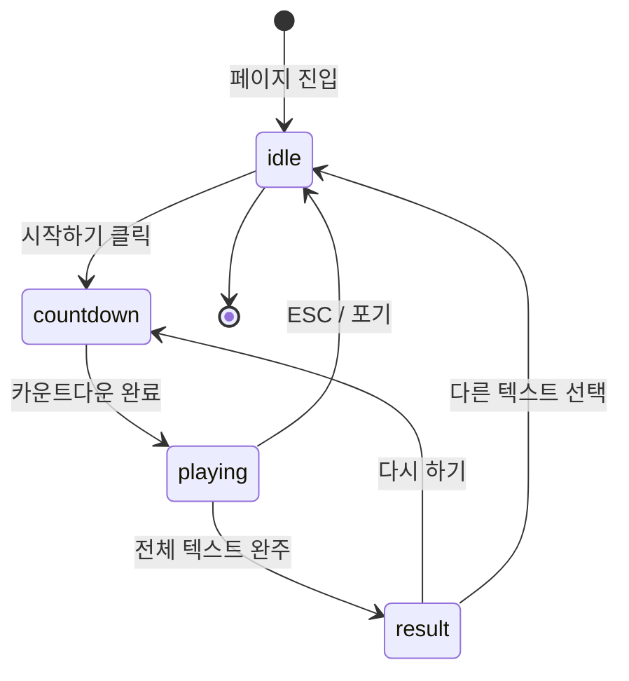
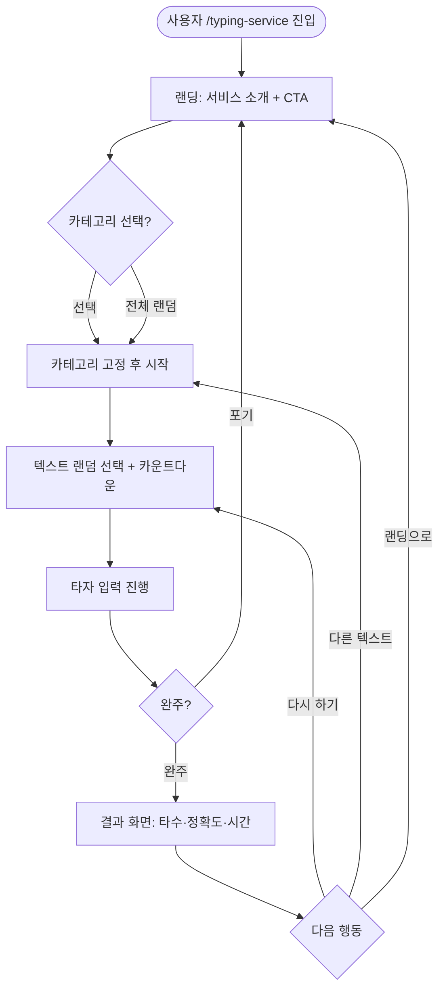

# typing-race 서비스 기획서

| 버전 | 날짜 | 변경 내용 |
| --- | --- | --- |
| v0.1 | 2026-04-21 | 1차 솔로 모드 기준 기획서 초안 작성 |

대상 독자: 기획자, 디자이너, 개발자 누구나

---

## 1. 기획 배경

### 왜 만드나?

yeon.world는 부트캠프·교육 프로그램 운영 플랫폼이다.
플랫폼 자체의 트래픽을 키우기 위해 `공개 서비스` 하나를 붙인다.
타자 연습은 부트캠프 수강생, 개발 입문자, 일반 사용자 모두가 쓸 수 있는 저진입 서비스다.

핵심 목표:
- 로그인 없이 바로 시작할 수 있는 타자 연습 서비스를 만든다
- SEO 유입 → 실제 사용 → 플랫폼 인지까지 이어지는 공개 진입점을 만든다
- 1차는 솔로 연습만. 이후 멀티 레이스로 확장할 수 있는 구조를 지금부터 잡는다

### 주 타깃 사용자

- 부트캠프 입문자: 타자 속도를 올리고 싶은 수강생
- 개발 입문자: 코드 타자 연습이 필요한 사람
- 일반 사용자: 한국어 타자 속도를 측정하고 싶은 사람

---

## 2. 등장인물

| 역할 | 설명 |
| --- | --- |
| **익명 사용자** | 로그인 없이 플레이. 결과는 세션 내에서만 유지, 저장 없음 |
| **로그인 사용자** | yeon 계정으로 로그인한 사용자. 결과 저장·기록 조회 가능 (2차 예정) |

> 1차는 익명 사용자만 지원한다. 로그인 연동은 2차 범위다.

---

## 3. 텍스트 seed 정책

### 텍스트 seed란?

타자 연습에서 **"이번 게임에서 칠 문장"** 을 seed라고 한다.
솔로 모드에서는 클라이언트가 정적 목록에서 랜덤 선택한다.
(멀티 레이스에서는 서버가 내려줘야 모든 참가자가 같은 문장을 침)

### 1차 seed 정책

| 항목 | 결정 |
| --- | --- |
| 관리 방식 | 정적 JSON 파일 하드코딩 (`packages/race-shared/src/texts/`) |
| 카테고리 | 한국어 일상문장, 한국어 명언, 개발 관련 한국어 문장 |
| 길이 분류 | 짧음(30~60자), 보통(61~120자), 긴것(121~200자) |
| 선택 방식 | 매 게임 시작 시 카테고리 내 랜덤 선택 |
| 카테고리 선택 | 사용자가 시작 전 선택 가능, 미선택 시 전체 랜덤 |

### seed 텍스트 예시

**한국어 일상문장**
- "오늘 하루도 수고 많았습니다. 작은 것에 감사하며 살아가는 것이 행복의 시작입니다."
- "봄이 오면 꽃이 피고, 꽃이 지면 열매가 맺힌다."

**한국어 명언**
- "천 리 길도 한 걸음부터 시작된다."
- "배움에는 끝이 없고, 노력에는 반드시 결실이 따른다."

**개발 관련**
- "변수 이름은 짧기보다 명확해야 한다. 코드는 사람이 읽는 것이다."
- "버그를 고치는 가장 빠른 방법은 처음부터 올바르게 짜는 것이다."

---

## 4. 게임 규칙

### 4.1 타수 측정 방식

| 항목 | 기준 |
| --- | --- |
| 표시 단위 | **타/분 (CPM, Characters Per Minute)** |
| 계산 방식 | 경과 시간(분) 기준: `정확히 입력한 누적 글자 수 ÷ 경과 시간(분)` |
| 오타 처리 | 오타는 타수에 포함하지 않음. 수정 후 맞으면 그 시점부터 카운트 |
| 측정 시작 | 첫 글자 입력 시점부터 |
| 결과 타수 | 게임 종료 시점의 최종 타/분 |

> 한국어 타자 연습은 영어식 WPM보다 타수(CPM) 기준이 일반적이다.

### 4.2 정확도 계산

| 항목 | 기준 |
| --- | --- |
| 실시간 표시 | 현재까지 입력한 글자 중 정확히 입력한 비율 |
| 최종 정확도 | 전체 텍스트 대비 한 번도 오타 없이 통과한 글자 비율 |
| 오타 표시 | 오타 글자는 빨간색 하이라이트, 수정 후 정상이면 초록색으로 전환 |

### 4.3 종료 조건

| 조건 | 처리 |
| --- | --- |
| 전체 텍스트 완주 | 자동 종료 → 결과 화면 |
| 중도 포기 (`ESC` 또는 포기 버튼) | 즉시 중단 → 랜딩으로 이동 (결과 없음) |

### 4.4 카운트다운

- 게임 시작 전 `3 → 2 → 1 → 시작!` 카운트다운 1초씩 진행
- 카운트다운 중에는 입력 불가

---

## 5. 게임 상태 모델

### 5.1 솔로 게임 상태



### 5.2 상태별 UI 동작

| 상태 | 설명 | 입력 가능 |
| --- | --- | --- |
| **idle** | 텍스트 선택, 시작 대기 | ❌ |
| **countdown** | 3·2·1 카운트다운 표시 | ❌ |
| **playing** | 타자 입력 진행 중. WPM·정확도 실시간 갱신 | ✅ |
| **result** | 최종 타수·정확도·소요 시간 표시 | ❌ |

---

## 6. 전체 서비스 플로우



---

## 7. 화면 구성

### 7.1 화면 목록

| 화면 | 경로 | 설명 |
| --- | --- | --- |
| **랜딩** | `/typing-service` | 서비스 소개 + 카테고리 선택 + 시작 CTA |
| **연습 화면** | `/typing-service/play` | 카운트다운 → 타자 입력 → 결과 오버레이 |

---

### 7.2 랜딩 화면 (`/typing-service`)

**목적**: 서비스 첫인상 + SEO 콘텐츠 + 즉시 진입 CTA

```
┌─────────────────────────────────────────────────────┐
│  [로고/네비]                               [로그인]  │
├─────────────────────────────────────────────────────┤
│                                                     │
│         타자 속도를 키워보세요                       │
│    한국어 타자 연습 · 지금 바로 시작하세요           │
│                                                     │
│  ┌─────────────┐ ┌─────────────┐ ┌─────────────┐  │
│  │ 한국어 일상  │ │  한국어 명언 │ │  개발 문장  │  │
│  │   문장      │ │             │ │             │  │
│  └─────────────┘ └─────────────┘ └─────────────┘  │
│         ┌─────────────────────────┐                │
│         │    지금 바로 시작하기    │                │
│         └─────────────────────────┘                │
│                                                     │
├─────────────────────────────────────────────────────┤
│  서비스 소개                                        │
│  · 로그인 없이 바로 시작                            │
│  · 실시간 타수·정확도 측정                          │
│  · 다양한 한국어 텍스트                             │
├─────────────────────────────────────────────────────┤
│  FAQ                                               │
│  Q. 타수는 어떻게 계산하나요?                       │
│  Q. 로그인 없이 사용할 수 있나요?                   │
│  Q. 텍스트를 직접 추가할 수 있나요?                 │
└─────────────────────────────────────────────────────┘
```

**영역별 상세**

| 영역 | 내용 |
| --- | --- |
| **히어로** | 서비스 타이틀, 한 줄 소개 |
| **카테고리 선택** | 한국어 일상문장 / 한국어 명언 / 개발 문장 3종 카드. 선택 시 하이라이트. 미선택 = 전체 랜덤 |
| **CTA 버튼** | "지금 바로 시작하기" → `/typing-service/play?category={선택값}` |
| **서비스 소개** | 특징 3가지 아이콘 카드 |
| **FAQ** | 3~5개 자주 묻는 질문. JSON-LD 구조화 데이터 포함 |
| **푸터** | yeon.world 링크 |

---

### 7.3 연습 화면 (`/typing-service/play`)

**연습 화면은 3개 상태를 같은 URL에서 처리한다: countdown → playing → result**

#### 7.3-1. 카운트다운 상태

```
┌─────────────────────────────────────────────────────┐
│  [← 나가기]              한국어 일상문장             │
├─────────────────────────────────────────────────────┤
│                                                     │
│              ──── 준비하세요 ────                   │
│                                                     │
│                      3                             │
│                                                     │
│   ┌───────────────────────────────────────────┐    │
│   │  봄이 오면 꽃이 피고, 꽃이 지면 열매가...   │    │
│   └───────────────────────────────────────────┘    │
│                                                     │
│   ┌───────────────────────────────────────────┐    │
│   │  [입력창 비활성]                           │    │
│   └───────────────────────────────────────────┘    │
└─────────────────────────────────────────────────────┘
```

#### 7.3-2. 진행 중 상태

```
┌─────────────────────────────────────────────────────┐
│  [← 나가기]              한국어 일상문장             │
├─────────────────────────────────────────────────────┤
│                                                     │
│   타수: 234 타/분    정확도: 97%    경과: 00:23     │
│   ████████████████████░░░░░░░░░░  68%              │
│                                                     │
├─────────────────────────────────────────────────────┤
│                                                     │
│   ┌───────────────────────────────────────────┐    │
│   │                                           │    │
│   │  봄이 오면 꽃이 피고,                      │    │
│   │  ████████████                             │    │
│   │  완료(회색)  현재(검정/커서)  미입력(연회색)  │    │
│   │                                           │    │
│   └───────────────────────────────────────────┘    │
│                                                     │
│   ┌───────────────────────────────────────────┐    │
│   │  꽃이 지▌                                 │    │
│   └───────────────────────────────────────────┘    │
└─────────────────────────────────────────────────────┘
```

**텍스트 표시 규칙**

| 글자 상태 | 표시 |
| --- | --- |
| 입력 완료 (정확) | 초록색 또는 회색 (완료 표시) |
| 입력 완료 (오타) | 빨간색 |
| 현재 입력 위치 | 커서 블링크 |
| 미입력 | 연회색 |

**상단 HUD 항목**

| 항목 | 설명 |
| --- | --- |
| 타수 | 현재 타/분 (실시간 갱신, 1초 단위) |
| 정확도 | 현재까지 입력한 글자 중 정확한 비율 |
| 경과 시간 | 첫 입력 시점부터 mm:ss |
| 진행률 | 전체 텍스트 대비 완료 글자 % 프로그레스 바 |

#### 7.3-3. 결과 오버레이 (완주 시)

```
┌─────────────────────────────────────────────────────┐
│  [← 나가기]              한국어 일상문장             │
├─────────────────────────────────────────────────────┤
│  ┌─────────────────────────────────────────────┐   │
│  │                                             │   │
│  │           🎉 완료!                          │   │
│  │                                             │   │
│  │   타수         정확도        소요 시간       │   │
│  │   312 타/분    98%          00:41           │   │
│  │                                             │   │
│  │   ┌──────────┐  ┌──────────┐  ┌─────────┐  │   │
│  │   │ 다시 하기 │  │ 다른 텍스트│  │ 랜딩으로│  │   │
│  │   └──────────┘  └──────────┘  └─────────┘  │   │
│  │                                             │   │
│  └─────────────────────────────────────────────┘   │
│  (배경에 텍스트 희미하게 유지)                       │
└─────────────────────────────────────────────────────┘
```

**결과 화면 항목**

| 항목 | 내용 |
| --- | --- |
| **타수** | 최종 타/분 (CPM) |
| **정확도** | 최종 정확도 % |
| **소요 시간** | 첫 입력 ~ 완주까지 elapsed time |
| **다시 하기** | 같은 텍스트로 카운트다운부터 재시작 |
| **다른 텍스트** | 같은 카테고리에서 새 텍스트 랜덤 선택 |
| **랜딩으로** | `/typing-service`로 이동 |

---

### 7.4 화면별 상태 배지 없음

솔로 1차에서는 계정 없으므로 상태 배지 불필요.

---

## 8. SEO 정책

| 항목 | 내용 |
| --- | --- |
| **페이지 타이틀** | `타자 연습 - 한국어 타자 속도 측정 \| yeon` |
| **description** | `로그인 없이 바로 시작하는 한국어 타자 연습. 타수와 정확도를 실시간으로 확인하세요.` |
| **canonical** | `https://yeon.world/typing-service` |
| **Open Graph** | title, description, image(og:image) 포함 |
| **JSON-LD** | FAQ 구조화 데이터 |
| **sitemap** | `/typing-service` 포함 |
| **robots** | index, follow |

---

## 9. 익명/계정 정책

| 항목 | 1차 정책 |
| --- | --- |
| 로그인 없이 플레이 | ✅ 가능 |
| 결과 저장 | ❌ (세션 내 메모리만) |
| 기록 조회 | ❌ |
| 랭킹 등록 | ❌ |
| 로그인 유도 | 결과 화면에 "기록 저장은 로그인 후 가능합니다" 안내만 (2차 예정) |

---

## 10. 기능 요구사항 (FR)

| ID | 구분 | 요구사항 | 수용 기준 |
| --- | --- | --- | --- |
| FR-01 | 랜딩 | 사용자는 `/typing-service`에서 카테고리를 선택하거나 선택 없이 바로 시작할 수 있어야 한다 | 카테고리 미선택 시 전체 랜덤, 선택 시 해당 카테고리에서만 seed 선택 |
| FR-02 | seed 선택 | 게임 시작 시 선택된 카테고리 내에서 텍스트를 랜덤 선택해야 한다 | 같은 게임에서 같은 텍스트가 연속으로 나오지 않아야 한다 |
| FR-03 | 카운트다운 | 게임 시작 전 3·2·1 카운트다운이 진행돼야 하며 카운트다운 중 입력이 불가해야 한다 | 카운트다운 완료 후 자동으로 playing 상태 진입, 입력창 활성화 |
| FR-04 | 타수 측정 | 첫 글자 입력 시 타이머가 시작되고 정확히 입력한 글자 기준으로 타/분을 실시간 표시해야 한다 | 타수는 1초마다 갱신, 오타는 타수에 포함하지 않음 |
| FR-05 | 정확도 측정 | 입력 중 현재 정확도(%)를 실시간으로 표시해야 한다 | 오타 글자는 빨간색, 수정 후 정확하면 초록색으로 전환 |
| FR-06 | 진행률 표시 | 전체 텍스트 대비 완료 비율을 프로그레스 바로 표시해야 한다 | 완주 시 100%로 채워짐 |
| FR-07 | 완주 처리 | 전체 텍스트를 완주하면 자동으로 result 상태로 전환되고 최종 결과를 오버레이로 보여줘야 한다 | 마지막 글자 입력 즉시 결과 오버레이 표시 |
| FR-08 | 결과 표시 | 결과 화면에서 최종 타수·정확도·소요 시간을 보여줘야 한다 | 세 값 모두 표시, 다시 하기·다른 텍스트·랜딩으로 버튼 노출 |
| FR-09 | 중도 포기 | ESC 키 또는 나가기 버튼으로 게임을 중단하고 랜딩으로 돌아갈 수 있어야 한다 | 중단 시 결과 화면 없이 바로 랜딩으로 이동 |
| FR-10 | 다시 하기 | 결과 화면에서 "다시 하기"를 누르면 같은 텍스트로 카운트다운부터 재시작해야 한다 | 텍스트 변경 없이 상태만 countdown으로 리셋 |
| FR-11 | 다른 텍스트 | "다른 텍스트"를 누르면 같은 카테고리에서 새 텍스트를 랜덤 선택해 카운트다운부터 시작해야 한다 | 직전 텍스트와 다른 텍스트가 선택돼야 함 |
| FR-12 | 익명 플레이 | 로그인 없이 모든 기능을 사용할 수 있어야 한다 | 로그인 강제 리다이렉트 없음 |
| FR-13 | SEO | `/typing-service`에 title, description, canonical, OG, JSON-LD(FAQ)가 포함돼야 한다 | Lighthouse SEO 점수 90 이상 |
| FR-14 | sitemap | `/typing-service`가 sitemap.xml에 포함돼야 한다 | sitemap.xml에 해당 URL 노출 확인 |

---

## 11. 비기능 요구사항 (NFR)

| ID | 항목 | 요구사항 |
| --- | --- | --- |
| NFR-01 | 반응성 | 타자 입력 시 UI 반응이 16ms(60fps) 이내여야 한다. 입력 지연 체감 없어야 한다 |
| NFR-02 | 상태 일관성 | 같은 게임 내에서 타수·정확도·진행률 계산 기준이 일치해야 한다 |
| NFR-03 | 중단 복구 | 브라우저 새로고침 또는 탭 닫기 시 진행 중 게임 데이터를 복구하지 않는다. idle 상태로 재진입 |
| NFR-04 | seed 비중복 | 연속 게임에서 직전 텍스트와 같은 seed가 선택되지 않아야 한다 |
| NFR-05 | SEO | `/typing-service` Lighthouse SEO 90 이상, LCP 2.5초 이하 |
| NFR-06 | 모바일 대응 | 모바일에서도 텍스트·입력창 레이아웃이 깨지지 않아야 한다 (소프트 키보드 대응 포함) |

---

## 12. 요구사항 명세서 (SRS)

| 회차 | 대상 | 분류 | 기능명 | 기능 설명 | 비고 |
| --- | --- | --- | --- | --- | --- |
| 1차 | 익명 사용자 | 진입 | 랜딩 화면 | 서비스 소개 + 카테고리 선택 + 시작 CTA | 필수 |
| 1차 | 익명 사용자 | 설정 | 카테고리 선택 | 한국어 일상 / 명언 / 개발 문장 선택 또는 전체 랜덤 | 필수 |
| 1차 | 시스템 | 선택 | seed 텍스트 랜덤 선택 | 카테고리 내 텍스트 랜덤 선택, 직전 텍스트 제외 | 필수 |
| 1차 | 시스템 | 진행 | 카운트다운 | 3·2·1 카운트다운 후 playing 진입 | 필수 |
| 1차 | 익명 사용자 | 진행 | 타자 입력 | 텍스트 따라 입력, 오타 실시간 하이라이트 | 필수 |
| 1차 | 시스템 | 측정 | 타수 실시간 계산 | 첫 입력부터 1초 단위 타/분 갱신 | 필수 |
| 1차 | 시스템 | 측정 | 정확도 실시간 계산 | 입력 글자 중 정확한 비율 % 표시 | 필수 |
| 1차 | 시스템 | 측정 | 경과 시간 표시 | 첫 입력부터 mm:ss 경과 시간 표시 | 필수 |
| 1차 | 시스템 | 측정 | 진행률 프로그레스 바 | 전체 텍스트 대비 완료 비율 바 | 필수 |
| 1차 | 시스템 | 처리 | 완주 자동 종료 | 마지막 글자 입력 시 result 상태 전환 | 필수 |
| 1차 | 익명 사용자 | 결과 | 결과 오버레이 | 최종 타수·정확도·소요 시간 표시 + 3개 CTA | 필수 |
| 1차 | 익명 사용자 | 액션 | 다시 하기 | 같은 텍스트 카운트다운 재시작 | 필수 |
| 1차 | 익명 사용자 | 액션 | 다른 텍스트 | 같은 카테고리 새 텍스트 선택 후 재시작 | 필수 |
| 1차 | 익명 사용자 | 중단 | 중도 포기 | ESC 또는 나가기 버튼으로 랜딩 복귀 | 필수 |
| 1차 | 시스템 | SEO | 메타데이터 | title, description, canonical, OG, JSON-LD | 필수 |
| 1차 | 시스템 | SEO | sitemap | `/typing-service` sitemap.xml 포함 | 필수 |
| (2차) | 로그인 사용자 | 저장 | 결과 저장 | 게임 완주 결과를 계정에 저장 | 2차 예정 |
| (2차) | 로그인 사용자 | 조회 | 기록 조회 | 과거 플레이 기록 조회 | 2차 예정 |
| (2차) | 전체 | 랭킹 | 랭킹 보드 | 카테고리별 타수 랭킹 | 2차 예정 |
| (3차) | 전체 | 레이스 | 멀티 레이스 | 실시간 다인 레이스 모드 | 3차 예정 |
